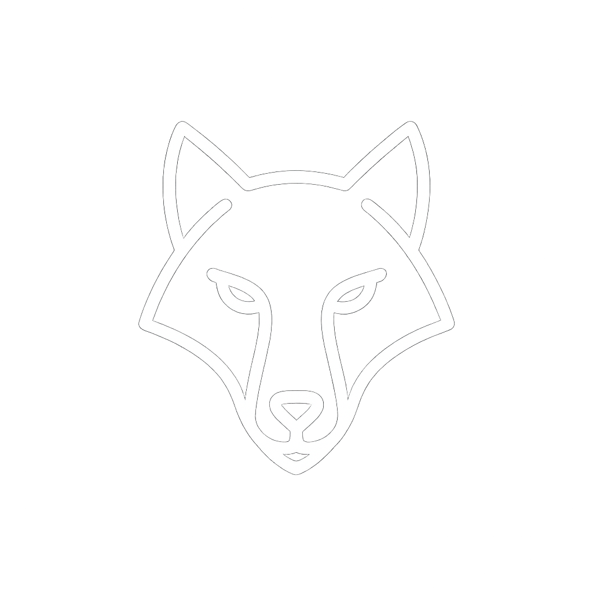

<!DOCTYPE html>
<html lang="ru">
<head>
    <meta charset="UTF-8">
    <meta name="viewport" content="width=device-width, initial-scale=1.0">
    <title>Wolf Messenger</title>
    <link rel="stylesheet" href="style.css">
    
    <link href="https://fonts.googleapis.com/css2?family=Inter:wght@400;500;600&display=swap" rel="stylesheet">
</head>
<body>
    <!-- Страница входа -->
    

        

            
            

                <input type="text" id="login" placeholder="ЛОГИН" class="login-input">
            

            

                <input type="password" id="password" placeholder="ПАРОЛЬ" class="login-input">
            

            <button onclick="checkPassword()" class="login-button">ВОЙТИ В СТАЮ</button>
            

        

    

    <!-- Основной интерфейс мессенджера -->
    

        <!-- Панель контактов -->
        

            

                

                    
                    WOLF PACK
                

            

            
            

                

                    
247

                    

                        
Агент 247

                        
Готов к работе

                    

                    
1

                

                
                

                    
ORG

                    

                        
Организатор

                        
Жду отчет

                    

                    
3

                

            

            
            

                
ID

                
Идентифицирован

            

        

        <!-- Основное окно чата -->
        

            

                

                    
247

                    

                        
Агент 247

                        
online

                    

                

            

            
            

                

                    

                        
Статус операции?

                        
12:30

                    

                

                
                

                    

                        
Все по плану. Цель в зоне видимости.

                        
12:31

                    

                

                
                

                    

                        
Жду сигнала для следующего шага.

                        
12:32

                    

                

            

            
            

                

                    <input type="text" class="message-input" placeholder="Сообщение...">
                    <button class="send-button">
                        <svg width="20" height="20" viewBox="0 0 24 24" fill="none">
                            <path d="M2 21L23 12L2 3V10L17 12L2 14V21Z" fill="currentColor"/>
                        </svg>
                    </button>
                

            

        

    

    
</body>
</html>
